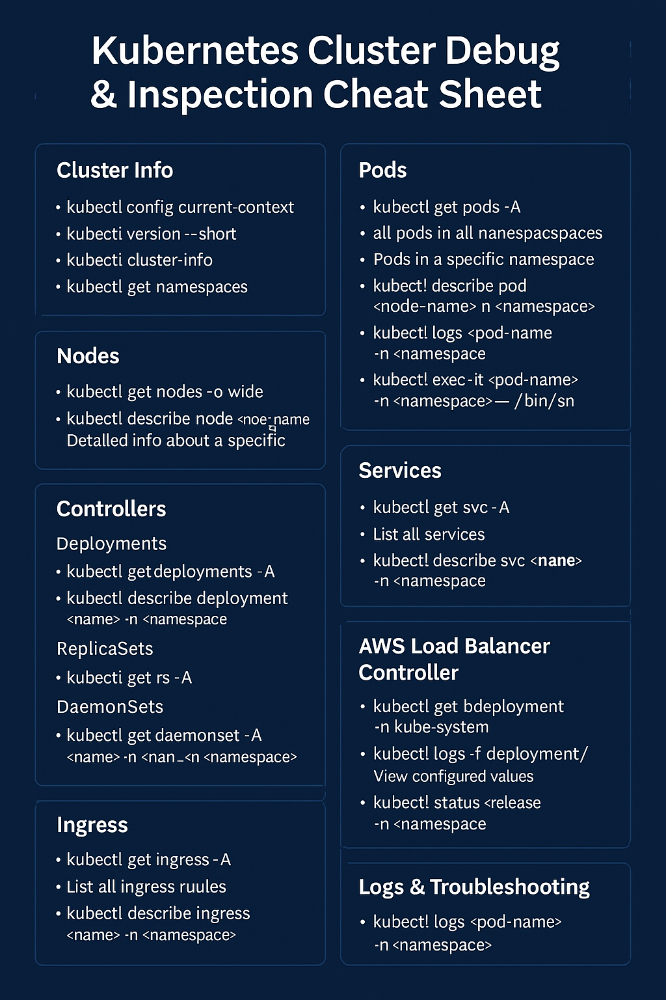

# EKS Apps — NGINX Ingress with AWS NLB & Multi-Namespace Applications

This setup deploys:
- **NGINX Ingress Controller** in Amazon EKS
- **AWS Network Load Balancer (NLB)** (Internet-facing)
- **Two sample applications** (`app1` & `app2`) each in their own namespace
- Fully automated deployment with **Terraform** + Kubernetes **manifest files**
- Support for **private EKS worker nodes** with **public NLB**

---

## 📌 Traffic Flow

```text
[ User Browser Request ]
          |
          v
[ Route53 DNS ]
  (app1.cloudcraftlab.work / app2.cloudcraftlab.work)
          |
          v
[ AWS NLB (Public Subnets) ]
          |
          v
[ NGINX Ingress Controller Pods ]
  (ingress-nginx namespace)
          |
          v
[ Ingress Resource ]
  (host-based routing)
          |
          v
[ Kubernetes Service ]
          |
          v
[ Application Pods ]
  (app1 namespace / app2 namespace)


⚙️ Terraform Usage

Prerequisites
	•	A running EKS cluster with:
	•	Worker nodes in private subnets
	•	At least one public subnet per AZ for the NLB
	•	kubectl configured to connect to the cluster
	•	terraform installed

⸻

Deploy

cd eks-apps
terraform init
terraform apply -auto-approve

Terraform will:
	•	Deploy the NGINX ingress controller using the Helm provider.
	•	Attach the NLB to public subnets.
	•	Apply all Kubernetes manifests in the manifests/ directory.

⸻

🧠 Kubernetes Cluster Debug & Inspection Cheat Sheet

This guide provides essential kubectl and helm commands to inspect and manage key components in your AWS EKS cluster, including nodes, pods, services, ingress, controllers, and load balancers.

⸻

📋 Table of Contents
	•	Cluster Info
	•	Nodes
	•	Pods
	•	Controllers (Deployments, ReplicaSets, DaemonSets)
	•	Services
	•	Ingress
	•	Helm Releases
	•	AWS Load Balancer Controller
	•	Logs & Troubleshooting
	•	Extras

⸻

📡 Cluster Info

```sh
kubectl config current-context           # Show current context (EKS cluster)
kubectl version --short                 # Client and server versions
kubectl cluster-info                    # Get cluster endpoints
kubectl get namespaces                  # List all namespaces
```

⸻

🧱 Nodes

```sh
kubectl get nodes -o wide               # List all worker nodes with details
kubectl describe node <node-name>      # Detailed info about a specific node
```

⸻

🚀 Pods

```sh
kubectl get pods -A                     # All pods in all namespaces
kubectl get pods -n <namespace> -o wide# Pods in a specific namespace
kubectl describe pod <pod-name> -n <namespace>
kubectl logs <pod-name> -n <namespace> # Logs of a pod
kubectl exec -it <pod-name> -n <namespace> -- /bin/sh
```

⸻

⚙️ Controllers

🔹 Deployments

```sh
kubectl get deployments -A
kubectl describe deployment <name> -n <namespace>
```

🔹 ReplicaSets

```sh
kubectl get rs -A
```

🔹 DaemonSets (e.g., NGINX Ingress Controller)

```sh
kubectl get daemonset -A
kubectl describe daemonset <name> -n <namespace>
```

⸻

🌐 Services

```sh
kubectl get svc -A                      # List all services
kubectl describe svc <name> -n <namespace>
kubectl get endpoints -n <namespace>   # Show service endpoints
```

⸻

🌍 Ingress

```sh
kubectl get ingress -A                 # List all ingress rules
kubectl describe ingress <name> -n <namespace>
```

⸻

📦 Helm Releases

```sh
helm list -A                           # All Helm releases
helm get values <release> -n <namespace>        # View configured values
helm status <release> -n <namespace>            # Status of a Helm release
```

⸻

🏗️ AWS Load Balancer Controller

```sh
kubectl get deployment -n kube-system                 # Check controller exists
kubectl logs -f deployment/aws-load-balancer-controller -n kube-system
```

⸻

🛠 Logs & Troubleshooting

```sh
kubectl logs <pod-name> -n <namespace>               # Pod logs
kubectl describe <resource> <name> -n <namespace>    # Describe any resource
kubectl get events -A --sort-by='.metadata.creationTimestamp'
```

⸻

🧹 Extras & Maintenance

```sh
kubectl delete pod <name> -n <namespace>             # Force restart a pod
kubectl rollout restart deployment <name> -n <namespace> # Restart deployment
kubectl get all -n <namespace>                       # All resources in a namespace
kubectl get svc,ingress,pods -n <namespace>          # Key components in one line
```

⸻


